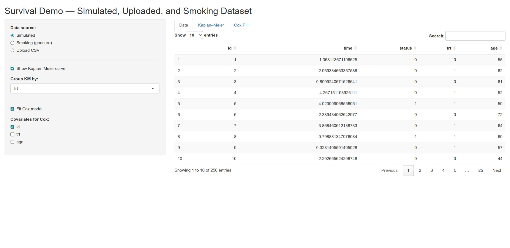

# Survival Analysis Shiny App

## 🌐 Live Demo
[Live App Link](https://wanfangzhang.shinyapps.io/rshiny/)

## App Screenshot

## Overview

This interactive Shiny application demonstrates core techniques in survival analysis in a compact, reproducible app suitable for portfolios, classroom demos, or research supplements.

Key functionality and what each part demonstrates:

- **Kaplan–Meier estimation (KM):**  
  Nonparametric estimation of the survival function. The app computes KM curves from `time` / `status` data and displays the estimated survival curve with marked event times. Use this to visualize survival probability over time without parametric assumptions.

- **Stratified (grouped) KM curves:**  
  You can stratify KM curves by a categorical variable (e.g., treatment group). This shows how survival differs across groups. The app restricts grouping to categorical variables (factors/characters or numeric variables with ≤8 unique values) for robustness.

- **Cox proportional hazards modeling (Cox PH):**  
  Fit semi-parametric Cox models `coxph()` to estimate covariate hazard ratios while leaving the baseline hazard unspecified. Select covariates interactively and inspect coefficient estimates, standard errors, and Wald tests.

- **Proportional hazards (PH) diagnostics:**  
  After fitting a Cox model the app runs a Schoenfeld residual test (`cox.zph`) to assess the proportional hazards assumption. The output helps decide whether Cox PH is appropriate or whether time-dependent effects / stratification are needed.

This app emphasizes defensive programming and reproducibility: robust input checks, clear error messages, and a minimal dependency footprint so it is stable when shared or deployed.

---

## Datasets included

1. **Simulated data (default):**  
   A small simulated dataset included for quick demonstration and for users who do not want to upload real data.

2. **Smoking cessation dataset (geecure::smoking):**  
   If you select *Smoking (geecure)* the app loads `geecure::smoking` and constructs survival time as `Timept2 - Timept1` and `status = Relapse`.  
   Reference: Banerjee, S. and Carlin, B. P. (2004). *Parametric spatial cure rate models for interval-censored time-to-relapse data*. Biometrics, 60: 268–275.

3. **User upload (CSV):**  
   You can upload your own CSV. The CSV **must** contain columns `time` and `status` (status: 1 = event, 0 = censored). Any additional columns are treated as covariates and may be used for stratification or Cox modeling.

---
